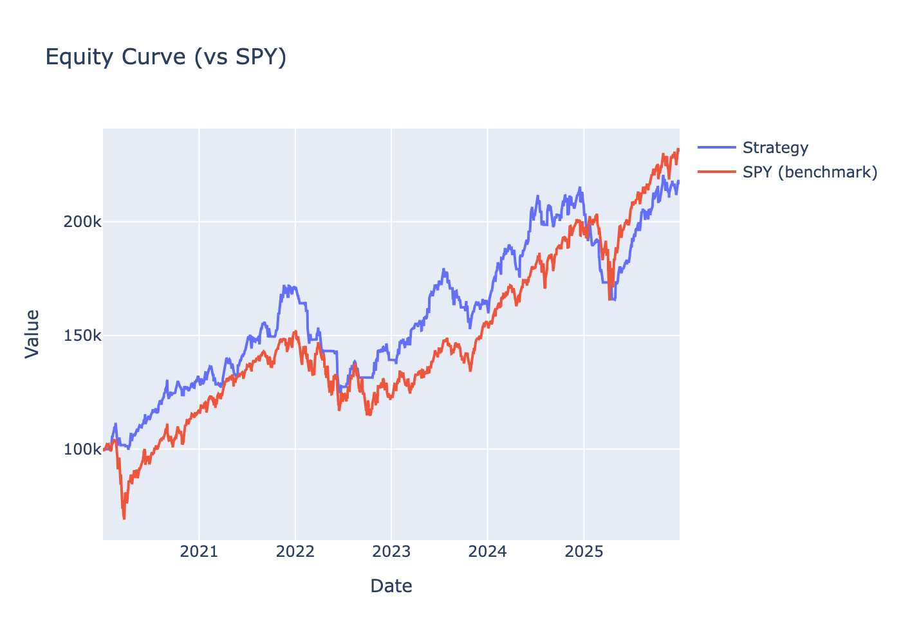
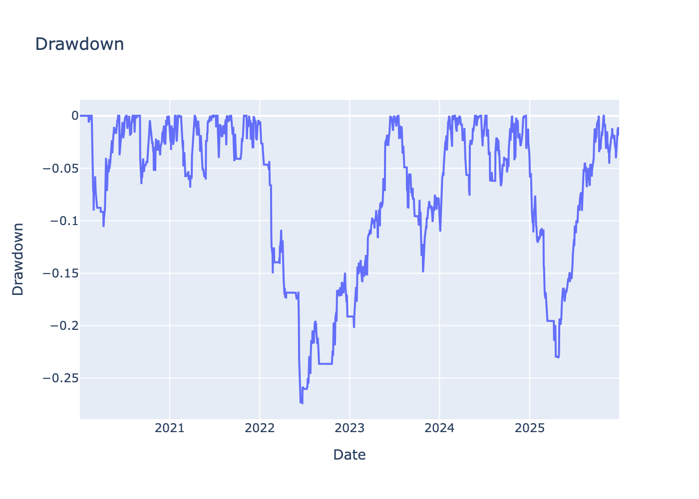
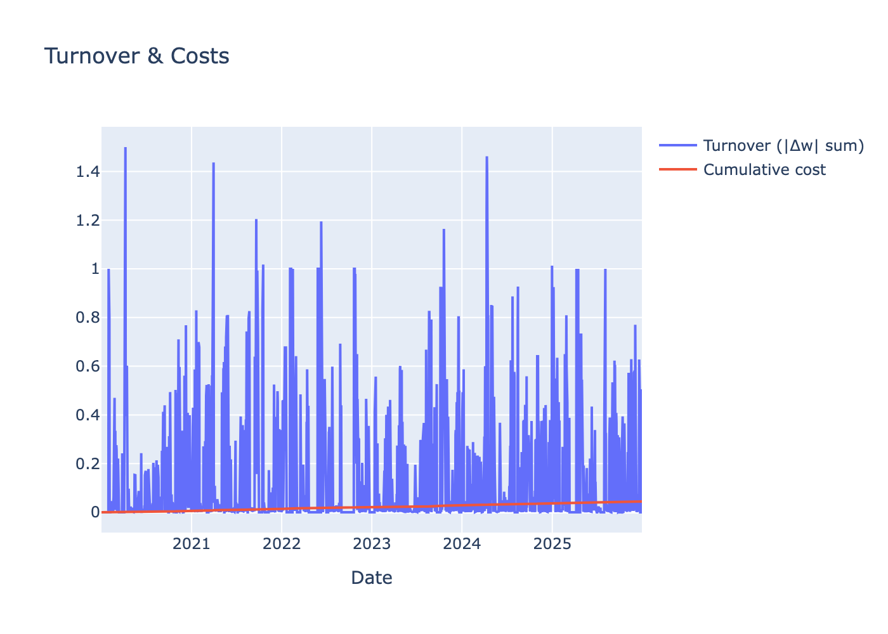
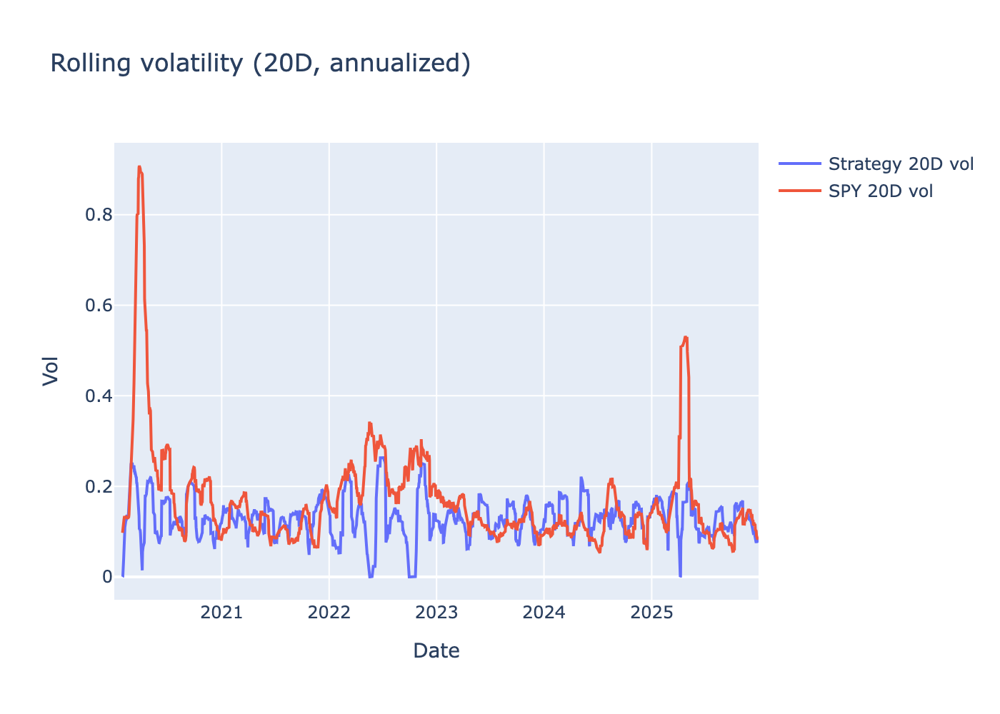
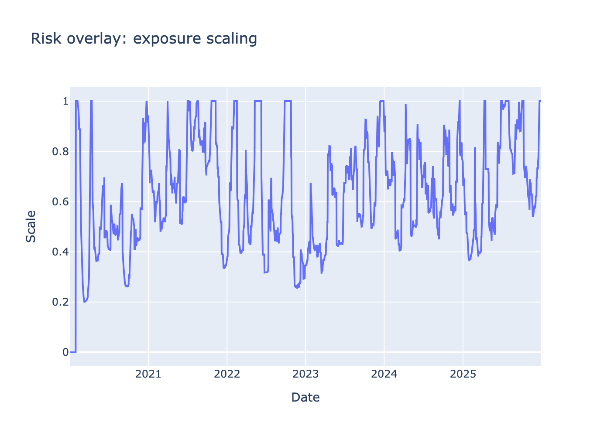
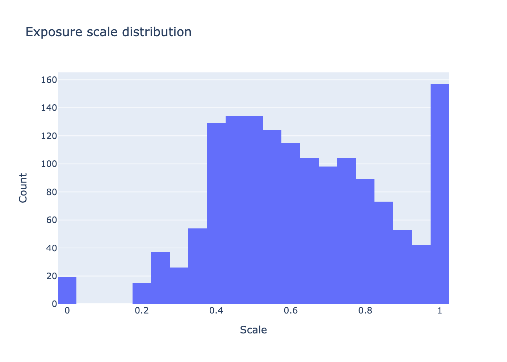

# TradeAgentLab Report: example

## Summary (strategy)
- CAGR: **13.78%**
- Vol (ann.): **14.20%**
- Sharpe: **0.98**
- Max Drawdown: **-27.39%**
- Beta vs SPY: **0.37**
- Alpha (ann., naive): **7.94%**

- Benchmark (SPY) CAGR: **15.01%**, Sharpe: **0.78**, MDD: **-33.72%**

## Equity (vs benchmark)

## Drawdown

## Turnover & transaction costs

## Rolling risk metrics

## Risk overlay (exposure scale)
- Last scale: **1.00**
- Days killed (scale=0 due to DD): **0**

### Exposure scale distribution

## Risk events timeline
- Kill switch triggers: **0** days
- Scale clipped (raw_scale > max): **143** days

### Kill switch days
(none)

### Clipped days
| Date                |   vol_est_% |   scale | reason                                                                           |
|:--------------------|------------:|--------:|:---------------------------------------------------------------------------------|
| 2025-07-25 00:00:00 |        9.04 |       1 | VOL_TARGET: vol_est=9.04%, target=12.00% → raw_scale=1.33, scale=1.00 (CLIPPED)  |
| 2025-07-28 00:00:00 |        9.02 |       1 | VOL_TARGET: vol_est=9.02%, target=12.00% → raw_scale=1.33, scale=1.00 (CLIPPED)  |
| 2025-07-29 00:00:00 |        9.24 |       1 | VOL_TARGET: vol_est=9.24%, target=12.00% → raw_scale=1.30, scale=1.00 (CLIPPED)  |
| 2025-07-30 00:00:00 |        8.57 |       1 | VOL_TARGET: vol_est=8.57%, target=12.00% → raw_scale=1.40, scale=1.00 (CLIPPED)  |
| 2025-07-31 00:00:00 |        7.96 |       1 | VOL_TARGET: vol_est=7.96%, target=12.00% → raw_scale=1.51, scale=1.00 (CLIPPED)  |
| 2025-08-01 00:00:00 |       10.4  |       1 | VOL_TARGET: vol_est=10.40%, target=12.00% → raw_scale=1.15, scale=1.00 (CLIPPED) |
| 2025-09-30 00:00:00 |       11.68 |       1 | VOL_TARGET: vol_est=11.68%, target=12.00% → raw_scale=1.03, scale=1.00 (CLIPPED) |
| 2025-10-01 00:00:00 |       10.51 |       1 | VOL_TARGET: vol_est=10.51%, target=12.00% → raw_scale=1.14, scale=1.00 (CLIPPED) |
| 2025-10-02 00:00:00 |       10.33 |       1 | VOL_TARGET: vol_est=10.33%, target=12.00% → raw_scale=1.16, scale=1.00 (CLIPPED) |
| 2025-10-03 00:00:00 |       10.34 |       1 | VOL_TARGET: vol_est=10.34%, target=12.00% → raw_scale=1.16, scale=1.00 (CLIPPED) |
| 2025-10-06 00:00:00 |       10.32 |       1 | VOL_TARGET: vol_est=10.32%, target=12.00% → raw_scale=1.16, scale=1.00 (CLIPPED) |
| 2025-10-07 00:00:00 |       10.39 |       1 | VOL_TARGET: vol_est=10.39%, target=12.00% → raw_scale=1.15, scale=1.00 (CLIPPED) |
| 2025-10-08 00:00:00 |        9.71 |       1 | VOL_TARGET: vol_est=9.71%, target=12.00% → raw_scale=1.24, scale=1.00 (CLIPPED)  |
| 2025-10-09 00:00:00 |        9.72 |       1 | VOL_TARGET: vol_est=9.72%, target=12.00% → raw_scale=1.24, scale=1.00 (CLIPPED)  |
| 2025-12-22 00:00:00 |       11.33 |       1 | VOL_TARGET: vol_est=11.33%, target=12.00% → raw_scale=1.06, scale=1.00 (CLIPPED) |
| 2025-12-23 00:00:00 |       10.53 |       1 | VOL_TARGET: vol_est=10.53%, target=12.00% → raw_scale=1.14, scale=1.00 (CLIPPED) |
| 2025-12-24 00:00:00 |       10.47 |       1 | VOL_TARGET: vol_est=10.47%, target=12.00% → raw_scale=1.15, scale=1.00 (CLIPPED) |
| 2025-12-26 00:00:00 |       10.48 |       1 | VOL_TARGET: vol_est=10.48%, target=12.00% → raw_scale=1.15, scale=1.00 (CLIPPED) |
| 2025-12-29 00:00:00 |       10.57 |       1 | VOL_TARGET: vol_est=10.57%, target=12.00% → raw_scale=1.14, scale=1.00 (CLIPPED) |
| 2025-12-30 00:00:00 |       10.43 |       1 | VOL_TARGET: vol_est=10.43%, target=12.00% → raw_scale=1.15, scale=1.00 (CLIPPED) |

## Risk audit (last 10 days)
- `vol_est_ann` and `drawdown` are shown in **%**.

| Date       |    scale |   vol_est_ann |   drawdown | killed   | clipped   | reason                                                                           |
|:-----------|---------:|--------------:|-----------:|:---------|:----------|:---------------------------------------------------------------------------------|
| 2025-12-16 | 0.76459  |         15.69 |      -2.95 | False    | False     | VOL_TARGET: vol_est=15.69%, target=12.00% → raw_scale=0.76, scale=0.76           |
| 2025-12-17 | 0.769548 |         15.59 |      -3.93 | False    | False     | VOL_TARGET: vol_est=15.59%, target=12.00% → raw_scale=0.77, scale=0.77           |
| 2025-12-18 | 0.81173  |         14.78 |      -3.36 | False    | False     | VOL_TARGET: vol_est=14.78%, target=12.00% → raw_scale=0.81, scale=0.81           |
| 2025-12-19 | 0.920093 |         13.04 |      -2.64 | False    | False     | VOL_TARGET: vol_est=13.04%, target=12.00% → raw_scale=0.92, scale=0.92           |
| 2025-12-22 | 1        |         11.33 |      -2.39 | False    | True      | VOL_TARGET: vol_est=11.33%, target=12.00% → raw_scale=1.06, scale=1.00 (CLIPPED) |
| 2025-12-23 | 1        |         10.53 |      -1.33 | False    | True      | VOL_TARGET: vol_est=10.53%, target=12.00% → raw_scale=1.14, scale=1.00 (CLIPPED) |
| 2025-12-24 | 1        |         10.47 |      -1.19 | False    | True      | VOL_TARGET: vol_est=10.47%, target=12.00% → raw_scale=1.15, scale=1.00 (CLIPPED) |
| 2025-12-26 | 1        |         10.48 |      -0.96 | False    | True      | VOL_TARGET: vol_est=10.48%, target=12.00% → raw_scale=1.15, scale=1.00 (CLIPPED) |
| 2025-12-29 | 1        |         10.57 |      -1.5  | False    | True      | VOL_TARGET: vol_est=10.57%, target=12.00% → raw_scale=1.14, scale=1.00 (CLIPPED) |
| 2025-12-30 | 1        |         10.43 |      -1.73 | False    | True      | VOL_TARGET: vol_est=10.43%, target=12.00% → raw_scale=1.15, scale=1.00 (CLIPPED) |

## Latest holdings (top 10 weights)
| Ticker   |   weight |
|:---------|---------:|
| MSFT     |     0.25 |
| NVDA     |     0.25 |
| QQQ      |     0.25 |
| SPY      |     0.25 |

## Monthly returns (%)
|   year |       Jan |       Feb |       Mar |       Apr |       May |       Jun |       Jul |      Aug |       Sep |       Oct |      Nov |       Dec |
|-------:|----------:|----------:|----------:|----------:|----------:|----------:|----------:|---------:|----------:|----------:|---------:|----------:|
|   2020 | -0.02     |  3.83298  | -2.38731  |  5.5305   |  3.38168  |   3.4819  |  4.04824  |  7.24987 | -2.25005  | -0.798122 |  2.85227 |  3.07583  |
|   2021 | -0.663275 |  0.136467 | -1.56749  |  7.0759   | -0.601034 |   6.46931 |  1.21458  |  5.01488 | -3.38765  |  6.74025  |  6.65179 |  0.287863 |
|   2022 | -3.82271  | -8.31136  | -0.270962 | -4.63518  | -0.689889 | -10.4203  |  6.12802  | -2.71825 |  0        |  4.27329  |  5.59442 | -3.82257  |
|   2023 |  2.62598  |  2.59456  |  5.93404  |  0.461361 |  7.20087  |   4.01383 |  2.04335  | -4.45606 | -4.29241  | -4.17769  |  4.9222  |  1.0688   |
|   2024 |  5.20851  |  6.06599  |  2.21093  | -6.27833  |  7.87639  |   6.39848 | -0.980421 |  2.23027 | -0.839927 | -0.150648 |  1.94249 |  0.16029  |
|   2025 | -8.33365  | -2.8667   | -6.03715  | -3.87577  |  7.58619  |   6.05228 |  5.10741  |  1.50897 |  4.88878  |  2.62679  | -1.05416 |  0.215474 |

## Agent decision (structured & auditable)
**As of:** `2025-12-30`

**Regime:** `risk-on` (conf=0.65)

**Decision JSON:** `docs/agent/example_decision.json`

| ticker   |   weight | reason                                    |
|:---------|---------:|:------------------------------------------|
| MSFT     |     0.25 | 20D ret=0.15%, trend=flat, vol20D=17.22%. |
| NVDA     |     0.25 | 20D ret=4.24%, trend=up, vol20D=29.87%.   |
| QQQ      |     0.25 | 20D ret=0.50%, trend=flat, vol20D=12.88%. |
| SPY      |     0.25 | 20D ret=1.29%, trend=up, vol20D=8.26%.    |

## Notes
- Costs are modeled as: `turnover * transaction_cost_bps` (simplified).
- This is a research backtest, not investment advice.
